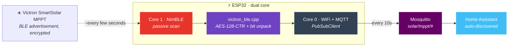

<div align="center">

# 🔋 Victron SmartSolar BLE → MQTT

**"A Raspberry Pi 4 drawing 4W to read one MPPT is an absurd tax on a solar battery."**

ESP32 firmware that reads a **Victron SmartSolar MPPT** over Bluetooth LE, decrypts the
advertisement, and publishes it to MQTT with full Home Assistant auto-discovery — at
**~0.15W** instead of ~4W.

[](#licence)
[](#hardware)
[](#4-build-and-upload)
[](#how-it-fits-together)
[](#mqtt-topics)
[](#home-assistant)
[](#power-consumption)
[](https://www.buymeacoffee.com/MrSossidge)

</div>

---

## The problem

Victron's `victron-ble` Python library is excellent, and running it on a Raspberry Pi 4 works
perfectly — until you notice the Pi is idling at 3–5W purely to relay a few numbers off a
charge controller. On an off-grid system that's around **40Wh a night**, or 3–4Ah at 12V:
the monitoring was costing more than the thing it was monitoring.

This firmware does the same job on an ESP32 at roughly a fortieth of the power, and behaves
better in Home Assistant while it's there.

## What you get

| | |
|---|---|
| 📶 **Reads the advertisement** | Passive BLE scan of the SmartSolar MPPT's broadcasts — no pairing, no connection, lower draw. |
| 🔐 **Real decryption** | AES-128-CTR exactly as the Victron BLE protocol specifies, matching the reference Python implementation bit for bit. |
| 📡 **MQTT every 10s** | One JSON payload with every value, plus a retained online/offline LWT topic. |
| 🏠 **Auto-discovery** | Appears in Home Assistant as a **Victron SmartSolar MPPT** device with entities grouped. No YAML. |
| 🧵 **Two cores, no crashes** | BLE scanning pinned to core 1, WiFi/MQTT to core 0 via FreeRTOS — sidesteps the radio coexistence crashes that come from sharing a core. |
| 🔌 **External load too** | The MPPT's load output current is published as amps, and multiplied by battery voltage to give watts — so the dashboard shows draw as well as charge. |
| 📊 **Dashboard included** | A ready-made Mushroom + Mini Graph dashboard card and optional template sensors. |
| 🪫 **0.15W idle** | The entire point. |

## How it fits together



SmartSolar MPPTs broadcast encrypted BLE advertisements every few seconds. Decryption uses
AES-128-CTR with your device's 32-character hex key, and a 16-bit nonce from the
advertisement used as the little-endian initial value of a 128-bit counter. The plaintext is
a bit-packed structure read LSB-first.

---

## Hardware

- An ESP32 dev board — tested on the **ESP32 CH340 38-pin**
- Within BLE range of the SmartSolar MPPT (~10m)
- A WiFi network

> The ESP32-C3 SuperMini also works, but needs the BOOT button held during flashing. The
> classic CH340 board is the easier one to live with.

## Quick start

### 1. Clone

```bash
git clone https://github.com/MrSossidge/victron-esp32-ble-mqtt.git
cd victron-esp32-ble-mqtt
```

### 2. Install VS Code + PlatformIO

Install [VS Code](https://code.visualstudio.com) and the **PlatformIO IDE** extension, then
open the project folder — PlatformIO reads `platformio.ini` and pulls dependencies itself.

### 3. Configure

```bash
cp include/example.config.h include/config.h
```

```cpp
#define WIFI_SSID       "your_wifi_ssid"
#define WIFI_PASSWORD   "your_wifi_password"
#define MQTT_HOST       "192.168.1.x"        // your MQTT broker IP
#define VICTRON_MAC     "xx:xx:xx:xx:xx:xx"  // lowercase, colon-separated
#define VICTRON_ENC_KEY "xxxxxxxxxxxxxxxxxxxxxxxxxxxxxxxx"  // 32 hex chars
```

`config.h` is gitignored — your key does not end up in a commit.

<details>
<summary><b>Finding your MAC address and encryption key</b></summary>

1. Open the **Victron Connect** app
2. Connect to your SmartSolar MPPT
3. Tap the **⋮ menu** → **Product Info**
4. The MAC address is at the top of that page
5. Scroll to **Instant readout via Bluetooth** and tap **SHOW** for the encryption key
</details>

### 4. Build and upload

| Action | Shortcut |
|---|---|
| Build | `Ctrl+Alt+B` |
| Upload | `Ctrl+Alt+U` |
| Serial monitor | `Ctrl+Alt+S` |

---

## MQTT topics

| Topic | Description |
|---|---|
| `solar/mppt/data` | JSON payload with all sensor values |
| `solar/mppt/status` | `online` / `offline` (retained LWT) |

```json
{
  "battery_voltage": "12.98",
  "battery_current": "-0.20",
  "pv_power": "8.0",
  "yield_today_wh": "350",
  "charge_state": "bulk",
  "charge_state_raw": 3,
  "error_code": 0,
  "external_load_a": "0.35",
  "external_load_w": "4.5"
}
```

<details>
<summary><b>Charge state values</b></summary>

| Value | State |
|---|---|
| 0 | Off |
| 2 | Fault |
| 3 | Bulk |
| 4 | Absorption |
| 5 | Float |
| 7 | Equalize |
| 245 | Starting |
| 252 | External control |
</details>

## Home Assistant

Once the ESP32 is running, go to **Settings → Devices & Services → MQTT**. A **Victron
SmartSolar MPPT** device appears with Battery Voltage (V), Battery Current (A), PV Power (W),
Yield Today (Wh), Charge State, Error Code, External Load (A) and External Load Power (W). No
manual YAML.

**Dashboard card** — [`dashboard.yaml`](dashboard.yaml) is ready to paste into
**Dashboard → Edit → Add Card → Manual**. It needs two HACS frontend plugins:
[Mushroom](https://github.com/piitaya/lovelace-mushroom) and
[Mini Graph Card](https://github.com/kalkih/mini-graph-card).

**Template sensors** — [`configuration_template.yaml`](configuration_template.yaml) adds two
optional calculated sensors: **Garage Net Battery Power** (current × voltage in watts,
positive = charging) and **Garage Battery Status** (Charging / Discharging / Idle). Add the
`template:` block to your `configuration.yaml` and reload YAML.

## Power consumption

| Device | Idle draw |
|---|---|
| Raspberry Pi 4 | ~3–5 W |
| ESP32 (this firmware) | ~0.15 W |

~4W saved overnight is ~40Wh per 10-hour night — roughly 3–4Ah at 12V, which is a real
fraction of a small leisure battery.

## Layout

```
├── include/
│   ├── example.config.h         template — copy to config.h
│   └── victron_ble.h            BLE parser header
├── src/
│   ├── main.cpp                 WiFi, MQTT, BLE scanning, FreeRTOS tasks
│   └── victron_ble.cpp          AES decryption and MPPT data parser
├── dashboard.yaml               ready-made Home Assistant dashboard card
├── configuration_template.yaml  optional template sensors
└── platformio.ini               build config
```

## Dependencies

PlatformIO handles all of these:

- [NimBLE-Arduino](https://github.com/h2zero/NimBLE-Arduino) — lightweight BLE stack
- [PubSubClient](https://github.com/knolleary/pubsubclient) — MQTT client
- [ArduinoJson](https://arduinojson.org) — JSON serialisation
- mbedtls — AES, bundled with the ESP32 Arduino core

## Related projects

- [victron-ble](https://github.com/keshavdv/victron-ble) — the Python library this follows; still the right answer on a Pi or Linux box
- [esphome-victron_ble](https://github.com/Fabian-Schmidt/esphome-victron_ble) — ESPHome component, if you prefer YAML
- [Victron_BLE_Advertising_example](https://github.com/hoberman/Victron_BLE_Advertising_example) — the original Arduino BLE example

## Licence

MIT.

## Support

If this got a Raspberry Pi out of your solar setup, you can buy me a coffee.

<a href="https://www.buymeacoffee.com/MrSossidge"></a>
